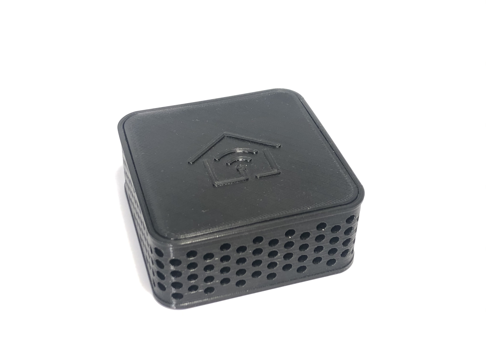
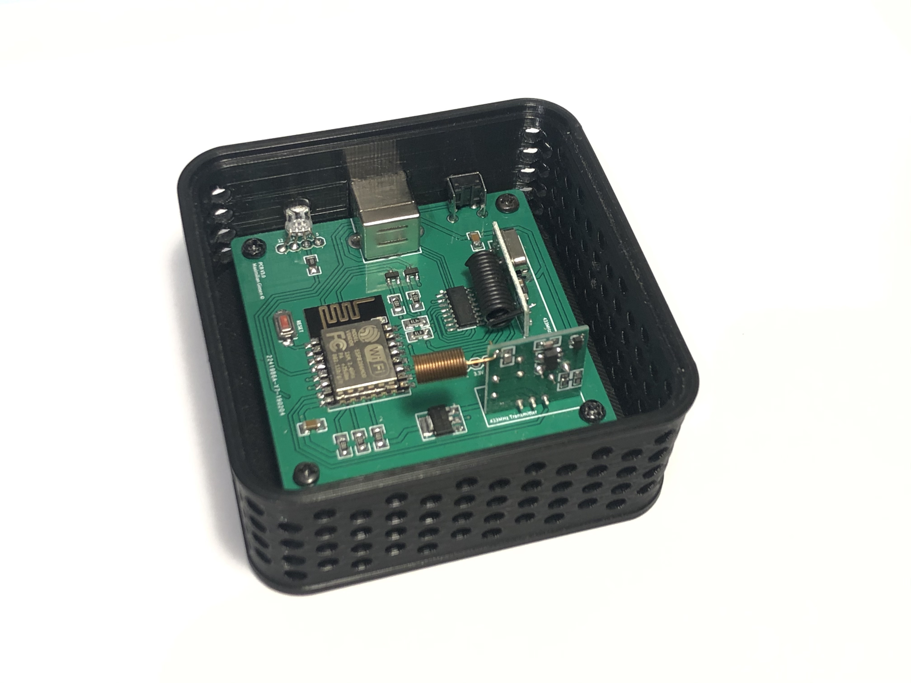
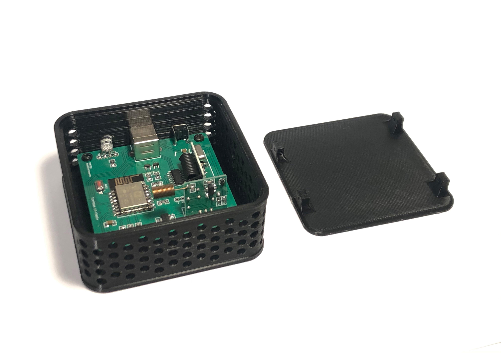
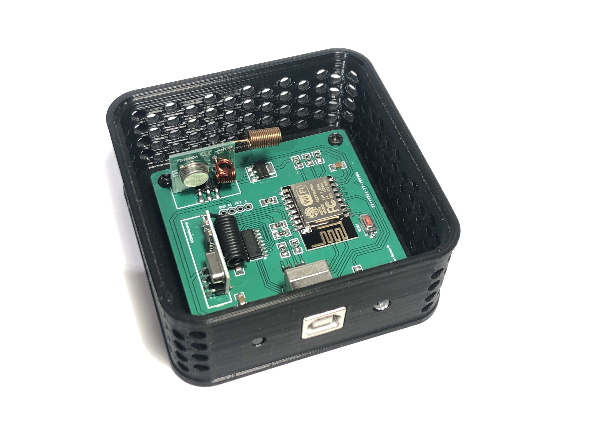
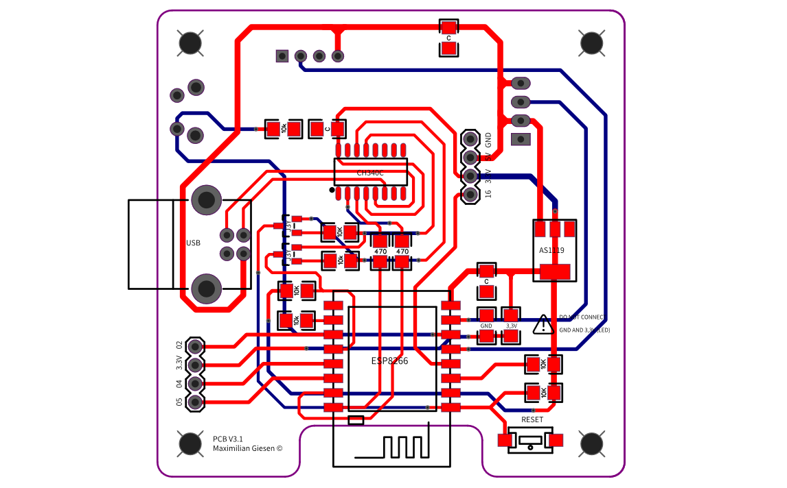
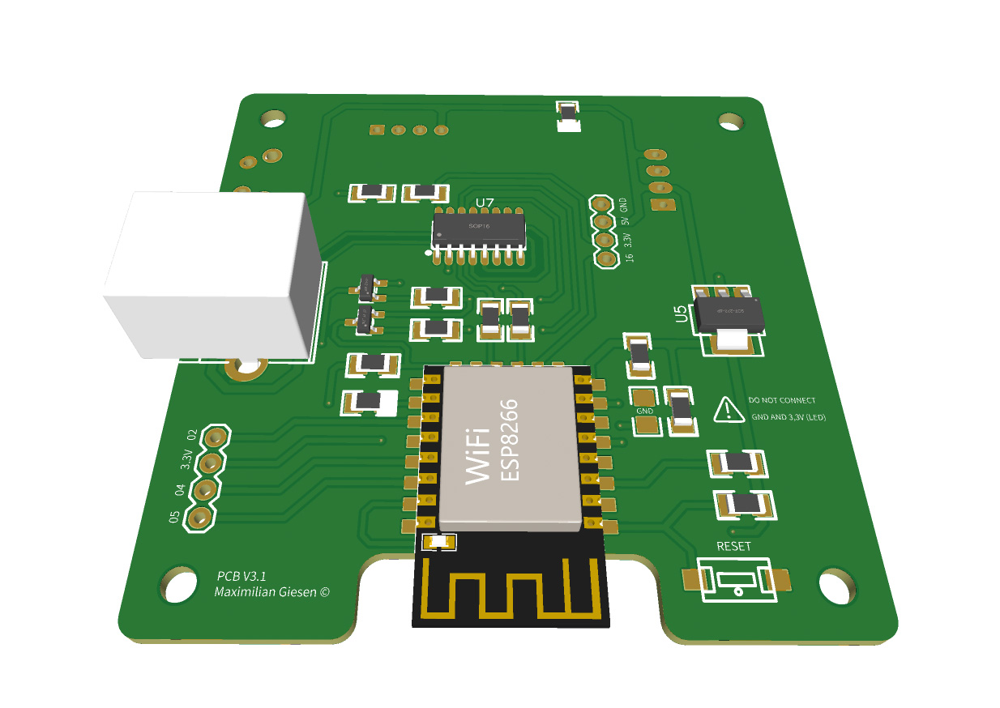
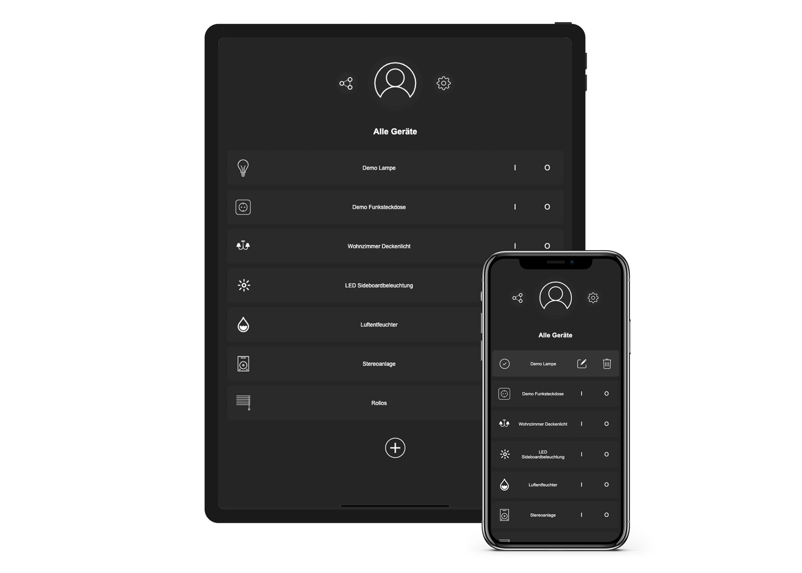
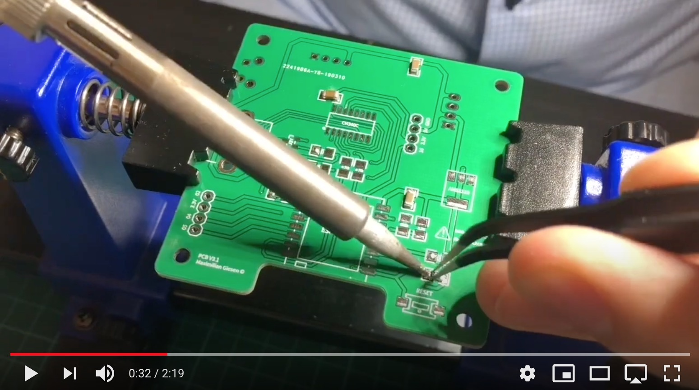
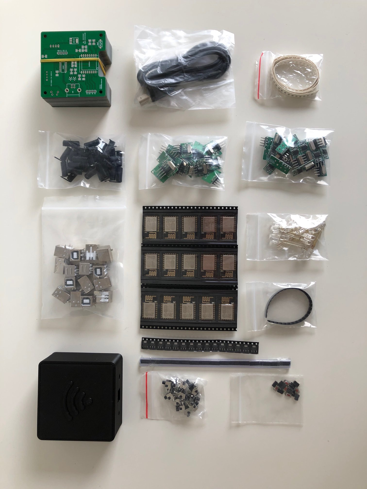

# Smart Home Hub
The Smart Home Hub is a simple and lightweight plattform to remote control 433 MHz devices using a mobile device like a smartphone or a tablet. The Hub is designed to be very cost efficient and open source. The overal material costs are less than 10 €. This enables you to get startet with a smart home in a simple way. Initially I designed the system around 2015 because of the high costs and rare availability of commercial solutions. After a couple of years I switched to the Homekit plattform to devote myself to new projects. I think meanwhile 433 MHz is outdated, but its still fun to play around and get an basic understanding of radio transmission. Hopefully the project helps you on your journey of development. 

### Casing
The original case design was a little more basic to enable injection molding, but since I decided to not commercialy produce the device, I changed the casing a little bit for an special look. 

### Inside Look
In addition to smaller IC's, the PCB contains the follwing modules which are widely available on the market
- ESP8266 12E
- ISM Sender 433 MHz (FS1000A)
- ISM Receiver 433 MHz

### Casing lid
The lid consists of two parts, which are glued together, to prevent support structures while 3D printing
- The lid is locked by four screws on the site

### Backview
- Push button for hard reset
- USB Type B connector for data transmission and powering
- Indication RGB LED

### PCB Design
I realised that many RGB LEDs sharing the same pin-layout, but the one half is using a common anod, the other half a common cathod. Because I wanted to use both, as long as I have them in storage, I designed the circuit with a variable tracing possibility, where you either can connect GND or 3,3V to the LED. I did without different series resistors, to save material costs and soldering time.

### Software
To enable a good availability, the UI is served as a webapp, stored on the ESP8266. Every modern Browser can open the interface, as long as it is connected to a local wifi. To setup the Smart Home Hub, there is an captive portal to enter the wifi credentials. For design reasons I implemented a solution, but there are plenty of very good librarys for that. 

### Assembling 

### Parts

### Disclaimer
I didn't have it in mind to make the project public, so the documentation is probably not perfect. Also, I am neither specialized in C++ nor in electronics. So every recommendation is welcome and feel free to improve the software as well as the design. Meanwhile, I am more than five years ahead and would probably do many things very differently than shown. If there are good improvements to the project made by the community, I will publish them but I didn't plan to work further on the project on my own. 

I hope you liked the small overview and can use the information for your own work

Cheers
Max
